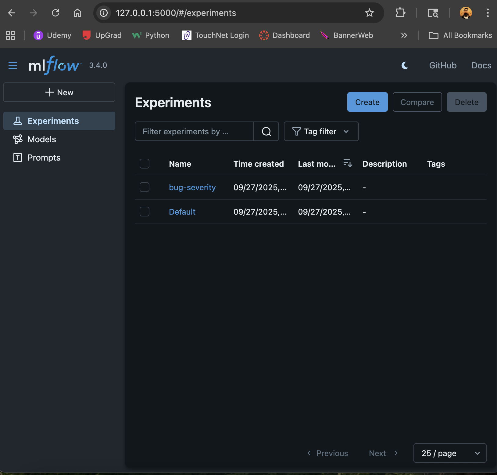
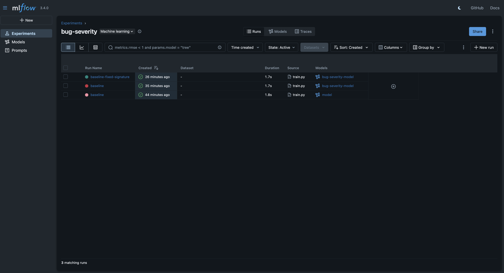
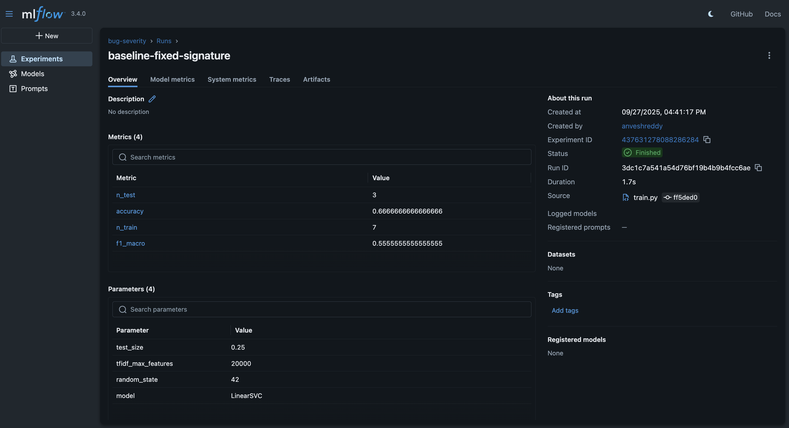
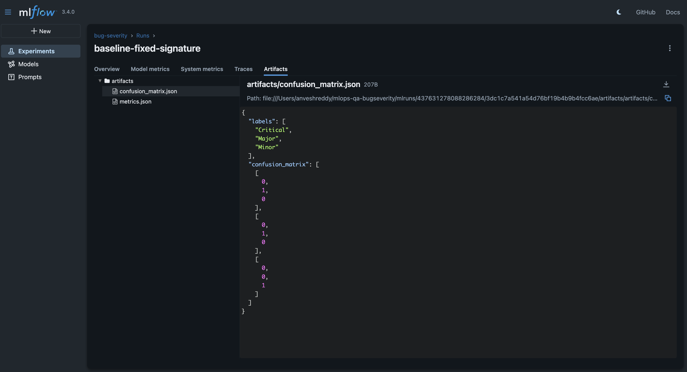
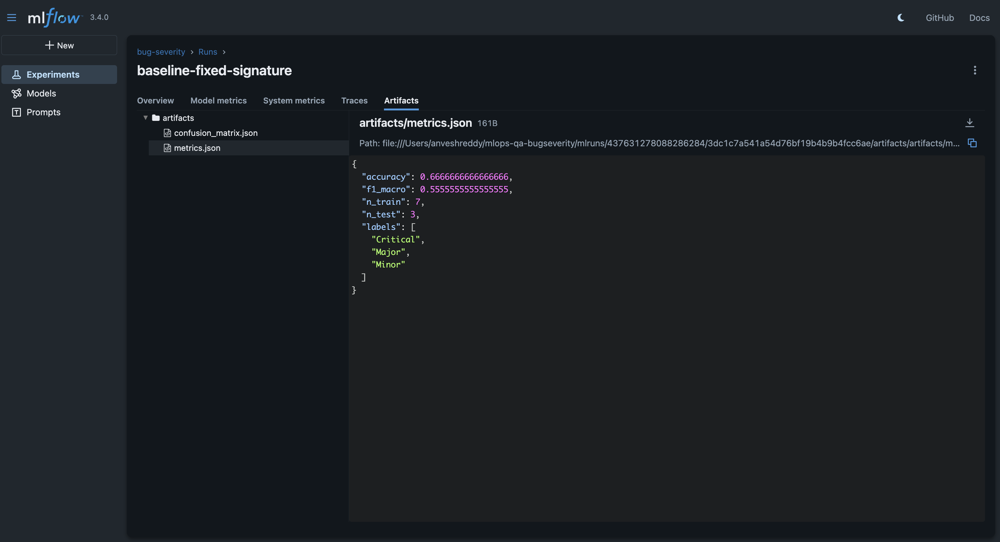
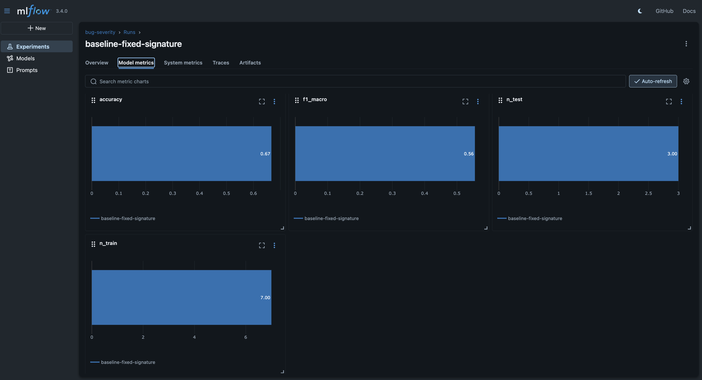

# Step 4 — Experiment Tracking with MLflow

## Overview
In this step we integrated **MLflow** to track bug severity model experiments.  
Every training run now logs metrics, artifacts, and models for reproducibility.

---

## Commands Used
```bash
# Run training with MLflow logging enabled
python src/train.py --data data/bugs.csv --outdir models --mlflow --run-name "baseline-fixed-signature"

# Start MLflow UI
mlflow ui --backend-store-uri ./mlruns -p 5000

Results
Experiment: bug-severity created automatically

Metrics logged: accuracy, f1_macro, n_train, n_test

Artifacts logged: metrics.json, confusion_matrix.json

Model logged: with explicit signature (string → string)

Screenshots












Troubleshooting Notes
artifact_path deprecated → switched to name parameter.

Serving validation error ('int' object has no attribute 'lower') → fixed by adding explicit model signature.

Outcome
- MLflow tracking integrated successfully.
- Each run reproducible with metrics + artifacts.
- Ready for publication screenshots & CI/CD integration.


---

## 2. Create `docs/troubleshooting_step4.md`
This is separate so you have a focused record of issues:

```markdown
# Troubleshooting – Step 4 (MLflow)

### Issue 1: `artifact_path` deprecated
- **Error:** `WARNING mlflow.models.model: artifact_path is deprecated`
- **Fix:** replaced with `name` when logging model.

---

### Issue 2: Serving validation error
- **Error:** `'int' object has no attribute 'lower'` when logging input example.
- **Cause:** MLflow tried to validate integer class labels with `.lower()`.
- **Fix:** logged explicit model signature instead of relying on input example.

---

### Issue 3: Local runs not visible
- **Cause:** forgot to run `mlflow ui --backend-store-uri ./mlruns`
- **Fix:** use explicit backend path and port (`5000`) to view local runs.

3. Commit both docs
git add docs/step4.md docs/troubleshooting_step4.md
git commit -m "docs: add step4 experiment tracking notes and troubleshooting"
git push origin main


